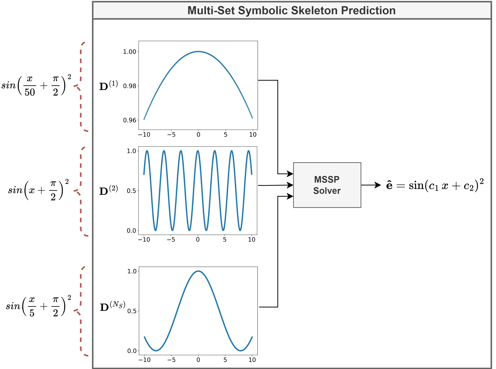
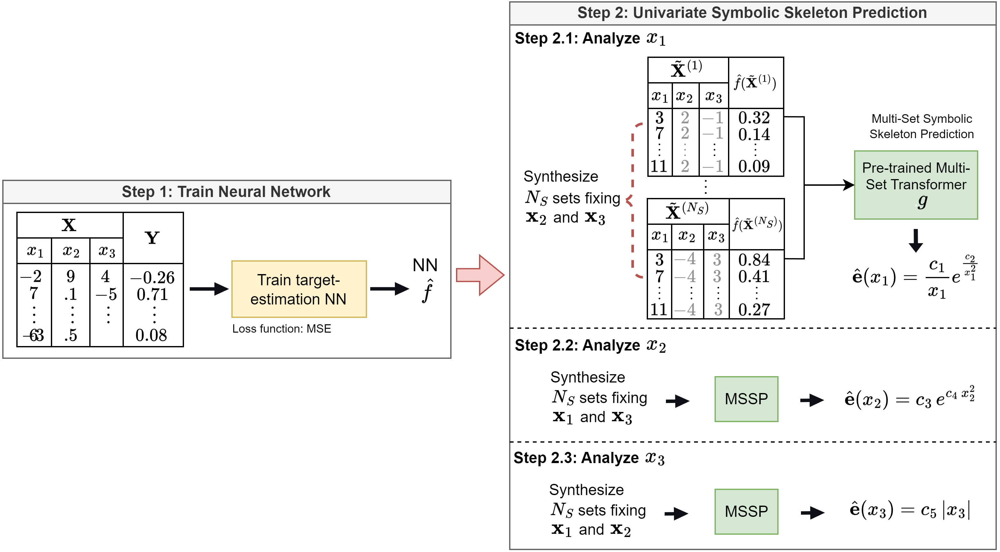

[](https://arxiv.org/abs/2406.17834)
[](https://colab.research.google.com/github/NISL-MSU/MultiSetSR/blob/master/DemoMSSP.ipynb)
[](https://colab.research.google.com/github/NISL-MSU/MultiSetSR/blob/master/DemoSeTGAP.ipynb)

# Decomposable Neuro-evolutionary Symbolic Regression

## Description

We present a method method called SeTGAP (**S**ymbolic R**e**gression using **T**ransformers, **G**enetic **A**lgorithms, and genetic **P**rogramming).
Given a multivariate regression problem that can be expressed in terms of a mathematical equation, SeTGAP identifies univariate symbolic skeleton expressions for each explanatory variable, which are later merged to approximate the true underlying equation of the system.

Our explainable SR method distills a trained "opaque" regression model into mathematical expressions that serve as explanations of the function approximated by the regression model.
First, our method employs a Multi-Set Transformer model to generate multiple univariate symbolic skeletons that characterize how each variable influences the system's response.
The performance of the generated skeletons is evaluated using a GA-based approach to select a subset of high-quality candidates before incrementally merging them via a GP-based cascade procedure that preserves their original skeleton structure.
The final multivariate skeletons undergo coefficient optimization via a GA.

To do this, we introduce a new SR problem called Multi-Set symbolic skeleton prediction (MSSP). It receives multiple 
sets of input--response pairs, where all sets correspond to the same functional form but use different equation constants, 
and outputs a common skeleton expression, as follows:

<p align="center">
  
</p>

We present a novel transformer model called "Multi-Set Transformer" to solve the MSSP problem. The model is pre-trained 
on a large dataset of synthetic symbolic expressions. The identification process of the functional form between each variable and the system's response is viewed as a sequence 
of MSSP problems:

<p align="center">
  
</p>

Our univariate skeleton prediction process can be viewed as an explainability method that produces skeletons to explain the function approximated by the regression model. 
**This process allows for a deeper understanding of how individual variables contribute to the system's behavior** and facilitates more insightful insights into the model's behavior. 

Therefore, the first component of the SeTGAP framework employs the Multi-Set Transformer to generate multiple univariate skeleton candidates per variable.
A GA-based selection process then filters out low-quality skeletons, retaining only the most informative ones.
Then, they are merged through an incremental GP-based procedure, which ensures that the merged expressions remain interpretable and aligned with the original structures.
Finally, a GA refines the numerical coefficients of the resulting multivariate expression.


## Installation

The following libraries have to be installed:
* [Git](https://git-scm.com/download/) 
* [Pytorch](https://pytorch.org/)
* PyMOO (for evolutionary optimization): `pip install pymoo==0.6.0`

To install the package, run `pip install git+https://github.com/NISL-MSU/MultiSetSR` in the terminal. 
This will also install additional packages such as pymoo, sklearn, and tensorboard.

You can also try the package on Google Colab to discover [univariate skeletons](https://colab.research.google.com/github/NISL-MSU/MultiSetSR/blob/master/DemoMSSP.ipynb)
or to discover the full [mathematical expression](https://colab.research.google.com/github/NISL-MSU/MultiSetSR/blob/master/DemoMSSP.ipynb).

## Usage

### Example using pre-determined datasets

In this example, we estimate the multivariate symbolic expression of a system whose underlying equation is one of the following:

<br>

| Eq. | Underlying equation________________________________________________________|
|-----|------------------------|
| E1  | $ (3.0375 x_1 x_2 + 5.5 \sin (9/4 (x_1 - 2/3)(x_2 - 2/3)))/5 $|
| E2  | $ 5.5 + (1- x_1/4) ^ 2 + \sqrt{x_2 + 10} \sin( x_3/5)$|
| E3  | $(1.5 e^{1.5  x_1} + 5 \cos(3 x_2)) / 10$|
| E4  | $((1- x_1)^2 + (1- x_3) ^ 2 + 100 (x_2 - x_1 ^ 2) ^ 2 + 100 (x_4 - x_3 ^ 2) ^ 2)/10000$|
| E5  | $\sin(x_1 + x_2 x_3) + \exp{(1.2  x_4)}$|
| E6  | $\tanh(x_1 / 2) + \text{abs}(x_2) \cos(x_3^2/5)$|
| E7  | $(1 - x_2^2) / (\sin(2 \pi \, x_1) + 1.5)$|
| E8  | $x_1^4 / (x_1^4 + 1) + x_2^4 / (x_2^4 + 1)$|
| E9  | $\log(2 x_2 + 1) - \log(4 x_1 ^ 2 + 1)$|
| E10 | $\sin(x_1 \, e^{x_2})$|
| E11 | $x_1 \, \log(x_2 ^ 4)$|
| E12 | $1 + x_1 \, \sin(1 / x_2)$|
| E13 | $\sqrt{x_1}\, \log(x_2 ^ 2)$|

***Parameters***:

*   `name`: Dataset name. Options: 'E1 - E13' 
*   `extrapolation`: If True, generate extrapolation data
*   `noise`: Noise level that is applied to the input variables N(0, noise)

```python
from EquationLearning.SymbolicRegressor.MSSP import *
from EquationLearning.SymbolicRegressor.SetGAP import SetGAP

datasetName = 'E6'
data_loader = DataLoader(name=datasetName)
data = data_loader.dataset
```

**Define NN and load weights**

For this example, we have already trained a feedforward neural network on the generated dataset so we only load their corresponding weights.

```python
device = torch.device("cuda:0" if torch.cuda.is_available() else "cpu")
root = get_project_root()
folder = os.path.join(root, "EquationLearning//saved_models//saved_NNs//" + datasetName)
filepath = folder + "//weights-NN-" + datasetName
nn_model = NNModel(device=device, n_features=data.n_features, NNtype=data_loader.modelType)
nn_model.loadModel(filepath)
```

**Get Estimated Multivariate Expressions**

The following method will generate some candidate multivariate expressions and select the most appropriates for the given dataset.

***Parameters***:

*   `data`: An object of the class [InputData](https://github.com/NISL-MSU/MultiSetSR/blob/95e7d822cef00e059bb1b6b9fe0ff85ab1ec987c/src/EquationLearning/Data/GenerateDatasets.py#L31)  
*   `bb_model`: Black-box prediction model (e.g., a feedforward neural-network) that we want to distill into a multivariate expression 
*   `n_candidates`: Number of candidate skeletons that are generated ($n_{cand}$ in the paper) 

**Note**: We recommend using $n_{cand}=4$ to generate a more diverse set of skeleton candidates. This will increase the computing time (but it may be worth it).

```python
regressor = SetGAP(dataset=data, bb_model=nn_model, n_candidates=2)
results = regressor.run()
```

### Example using custom equations

Here we will show how to use data generated from your own equations. 
Alternatively, you can bring your dataset (e.g., a CSV file) and load the matrix $X$ (explainable variables) and $Y$ (response variable).

In this example, consider the simple equation $y = \frac{\sin(x_1 + 1.2 \, x_2) \, x_3^2}{2}$. 
Suppose that $x_1$ and $x_2$ are continuous variables and $x_3$ is discrete and can take 100 possible values ($x_1 \in [-10, 10]$, $x_2 \in [-5, 5]$, and $x_3 \in [-8, ... , 8]$)

**Generate and format data**

```python
np.random.seed(7)
n = 10000
# Generate data from the equation
x1 = np.random.uniform(-10, 10, size=n)
x2 = np.random.uniform(-5, 5, size=n)
x3 = np.array([np.random.choice(np.linspace(-8, 8, 100)) for _ in range(n)])  # Example of discrete variable
X = np.array([x1, x2, x3]).T
Y = np.sin(x1 + 1.2 * x2) * (x3**2 / 2)  # Or load matrices X and Y from a CSV file

# Format the dataset
names = ['x0', 'x1', 'x2']  # Specify the names of the variables
types = ['continuous', 'continuous', 'discrete']  # Specify if the variables are continuous or discrete
dataset = InputData(X=X, Y=Y, names=names, types=types)
```

**Train a NN**

Unlike the previous example, we haven't trained a NN for this problem so let's train it now. 
If you're not satisfied with the validation MSE, you can try increasing the number of epochs or try a different architecture. 
By default, we use the `modelType='NN'`; if you need less complexity, try `modelType='NN2'`; or if you need more complexity, try `modelType='NN3'`.
You can always train a model with your own architecture, save it as a `.pth` file and load it here as we did in the previous example.

```python
from EquationLearning.Trainer.TrainNNmodel import Trainer

predictor = Trainer(dataset=dataset, modelType='NN')
predictor.train(batch_size=128, epochs=3000, printProcess=False)
# Save the model
# predictor.model.saveModel(path)  # Specify your own path
```

**Run SeTGAP**

Now, SeTGAP is executed as we did before:

```python
regressor = SetGAP(dataset=data, bb_model=nn_model, n_candidates=2)
results = regressor.run()
```

As a bonus, if you're only interested in discovering what are the functional forms that relate each system variable and the system's response,
you can run the univariate skeleton generator (MSSP) alone:

```python
regressor = MSSP(dataset=dataset, bb_model=predictor.model)
regressor.get_skeletons()
```


## Repository Structure

This repository contains the following main scripts:

* `MainSR.py`: Generates multiple multivariate mathematical expressions that approximate the true underlying equation of the system (results related to our latest paper, currently undergoing double-blind review).
* `MainUnivariateSkeletons.py`: Generates multiple symbolic skeletons that explain the functional form between each variable of the system and the system's response (results related to our ECML-PKDD 2024 paper).        
* `Comparison.py`: Compares the symbolic skeletons generated by our Multi-Set Transformer and other methods (Use `pip install pymoo==0.6.0` to avoid errors with the PyMOO library).
* `DemoSeTGAP.ipynb`: Jupyter notebook demo that demonstrates the the full SeTGAP framework (notebook under construction).
* `DemoMSSP.ipynb`: Jupyter notebook demo that demonstrates the symbolic skeleton generation for each system's variable.

Other important scripts:

* `/src/EquationLearning/Trainer/TrainMultiSetTRansformer.py`: Trains the Multi-Set Transformer to solve the MSSP based on a large dataset of pre-generated mathematical expressions.
* `/src/EquationLearning/Trainer/TrainNNmodel.py`: Trains the NN model $\hat{f}$ that acts as a black-box approximation of the system's underlying function $f$ and that is used to generate the artificial multiple sets used for MSSP.
* `/src/EquationLearning/SymbolicRegressor/SeTGAP.py`: Contains the main SeTGAP algorithm.
* `/src/EquationLearning/SymbolicRegressor/MSSP.py`: Generates univariate skeleton candidates for each system variable.


## Datasets

The datasets are available online at [https://huggingface.co/datasets/AnonymousGM/MultiSetTransformerData](https://huggingface.co/datasets/AnonymousGM/MultiSetTransformerData).
To replicate the training process, download the datasets and paste them into the `/src/data/sampled_data` folder.

# Citation
Use this Bibtex to cite this repository (*for SeTGAP, stay in tune, as it's currently under review*)

```
@INPROCEEDINGS{MultiSetSR,
author="Giorgio Morales and John W. Sheppard",
title="Univariate Skeleton Prediction in Multivariate Systems Using Transformers",
booktitle="Machine Learning and Knowledge Discovery in Databases: Research Track. ECML PKDD 2024",
year="2024",
location = {Vilnius, Lithuania}
}
```
